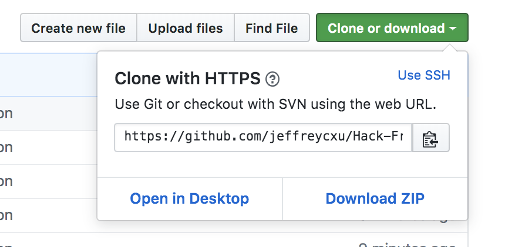
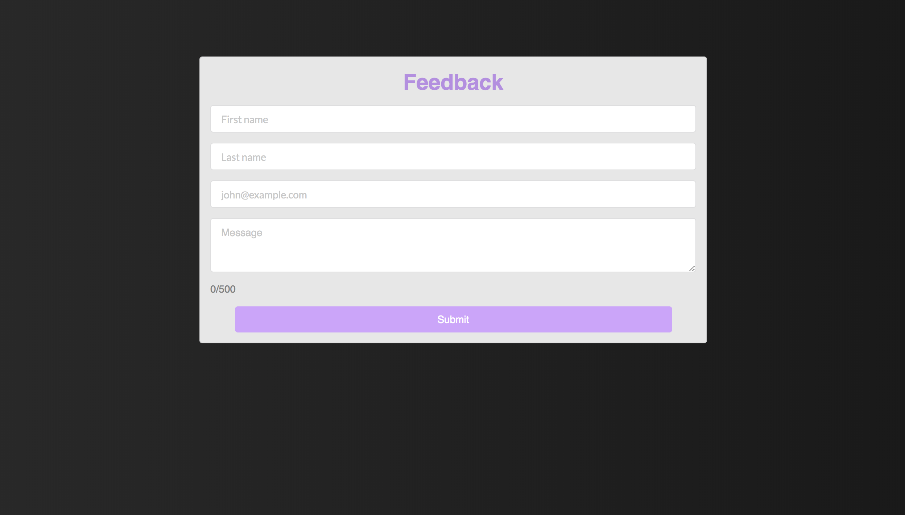

Thanks for checking out my App! 

Usage:

You can download this React App two ways based on preference. First click on the clone or download button on the top right side of the screen.  

Getting Started
There are two methods for getting started with this repo.

1) 
 ```
 git clone https://github.com/jeffreycxu/Hack-Front-End-Challenge.git
 cd Hack-Front-End_Challenge
 npm install
 npm start
 ```


2) Click here then download the .zip file. Extract the contents of the zip file, then open your terminal, change to the project directory, and:
 ```
 npm install
 npm start
 ```



It might tell you that there are 63 low severity vulnerabilities caused by the braces package but it seems like that’s a bug in create-react-app: https://github.com/facebook/create-react-app/issues/6443. 




